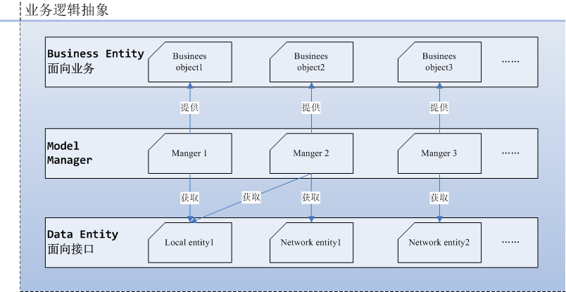

# Android 开发总览

## android 应用开发

一般地，一个应用可以拆分为多个业务模块：

	┕ app
		┕ module A
		┕ module B
		┕ module C
		...

*<small>**注：**这里的module不是android应用的library，而是业务模块。</small>*

单独的业务模块的功能实现又可以分为UI和业务逻辑：

	┕ module A
		┕ UI
		┕ Logic

	┕ module B
		┕ UI
		┕ Logic
	...

### · UI

UI用于显示，与用户交互。

Android应用中UI的方面的开发主要为：

- 编写布局（基础控件的使用）
- 实现效果
	- 动画
	- 自定义控件
	- ...

---
因此，android 开发中的UI部分，主要需要掌握的知识有：

- 基本UI组件
	- Activity
	- Fragment
	- View、Widget
	- ...
	
- View的机制
	- 测量
	- 布局
	- 绘制
	- 事件传递
	- ...

**注：**这里没有把动画列入内，其实动画是对“测量、布局、绘制”结合部分算法的综合应用。

### · 逻辑

“逻辑”归根结底是**对数据的处理**，包括 *数据的存取* 和 *数据与UI绑定显示* ；

**数据的存取** 包括：

- 文件
	- 资源文件
		- res
		- assets
	- 本地
		- data
		- SD卡
	- 数据库（特殊的本地文件）
- 网络

---
因此，涉及到的知识包括：

- IO
- 数据库API
- 网络通信

**数据与UI绑定显示** 方面：

- UI怎么得到数据：

	> 可以是直接获取，可以是异步请求得到

- UI和数据存取之间怎么建立联系

	> 这个可以借鉴MVC的思想，View（`Activity`或者`Fragment`）与Model之间插入ViewController负责绑定数据，ViewController和Model之间插入Model Manager，负责提供数据...
	> 
	> 如果在`Activity`或者`Fragment`中进行数据获取，就会不自觉地参杂部分数据逻辑或者业务逻辑

---
涉及到的知识包括：

- 多线程（线程池，同步，异步任务...）
- 消息分发机制（类广播）

## Android 基础支撑框架

UI部分的知识按照自身对技术的追求自行学习和理解，至于常用的自定义控件方面，网上或多或少能找到开源项目，对此不作赘述。

### 业务分层模式

**MVC**是常用的一种分层模式，同样地，Android也能实现这样的分层；

此外，还有诸如**MVP**，**MVVM**等模式，都是可以借鉴使用的。

我自己使用的是这样的一种分层：
`View`┉┉`View Controller`┉┉`Model Manager`┉┉`Model`

